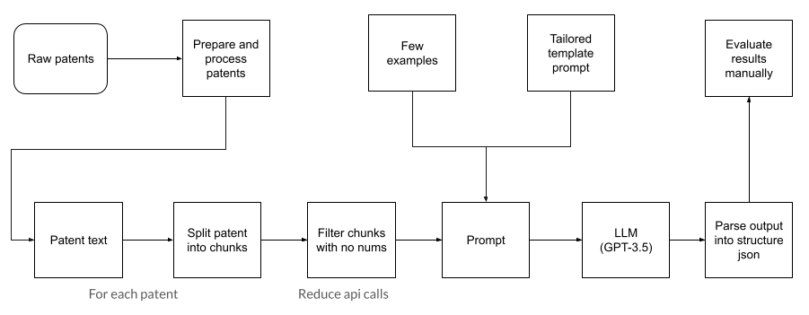

# patent-analysis-llm
Application to extract information about the measurements appearing in patents related document texts.
Here is an example of the task in hand. From the text:
```
“The resulting BaCO3 had a crystallite size of between about 20 and 40 nm” 
```
The following measurements will be extracted:
```javascript
{'element': 'BACO3', 'property': 'crystallite size', 'value': 'between 20 and 40', 'unit': 'nm'}
```

This repository is the result of a technical challenge for a Machine learning (LLM) position.

Regarding to the model used. Initially I wanted to use the [MPT-7B-instruct](https://huggingface.co/mosaicml/mpt-7b) model as it works quite well for an open source model and I can run it locally. However, after trying it I realised that the model is not powerful enough for this task and that it fails to learn the format of the desired output.
It is possible that fine-tuning could solve these problems, but I have chosen to use the [GPT-3.5-turbo](https://platform.openai.com/docs/models) model with a few-shot learning approach.

---
🔥 **New**: Generation of synthetic data for fine-tuning on the LLM GPT-3.5-turbo using the script [`src/generate_train_data.py`](src/generate_train_data.py) → The result of the generation with the texts and the measurements extracted from them can be consulted in the file [`results/generated_pantents.json`](results/generated_pantents.json). The results are very promising.

From this results we could fine-tune the LLM by following the [openai guide](https://platform.openai.com/docs/guides/fine-tuning/preparing-your-dataset).

## Pipeline Overview
The approach to this task is to create a pipeline that performs few-shot learning to extract the desired information from the data. Below is a diagram representing the implemented pipeline.



The tool performs the following steps to extract the measurements from patents:
1. Reads the XML file with the concatenated patents inside.
2. Split the XML into a list of XML patents.
3. For each patent parse it extracting the id, abstract and description. Each description can contain:
    1. BRFSUM: brief summary.
    2. DETDESC: detailed description.
    3. RELAPP: Related applications.
    4. GOVINT.
4. Save results in JSON format.
5. Load the JSON and take a sample from the pantents (just process a few tens for the experiment).
6. Load the LLM (GPT3.5-turbo or MPT-7B-instruct).
7. Create the prompt template (using [kor](https://eyurtsev.github.io/kor/tutorial.html)):
    1. Define the data schema desired to be in the LLMs output.
    2. Define the examples to use for the few-shot learning.
    3. Create a description of the patent schema.
8. Choose the data section to process (abstract, brief summary or detailed description).
9. For each patent we perform the following steps:
    1. Join all the paragraphs.
    2. Create text chunks (text_chunk + prompt_template + examples ~= MAX TOKENS from model). 
    3. Filter chunks that do not contain numbers (assuming that every measurement contains a number) so we reduce the api calls.
    4. Call the llm with the chunk inse the prompt template
    5. Parse the LLM output
    6. Validate the LLM ouput (the value must contain at least one number and the unit must be different from unitless, NA or similar)
10. Save the results of the extraction process

## Repo structure
This section shows the folders that make up this repository. Each folder has its own README.md file, so I invite you to explore this file if you are more interested in any section.

- [**data/**](data/README.md): Directory containing all the folders to store the input data and the preprocess data related to pantents.

- [**documentation/**](documentation/README.md): Directory containing useful examples and docs to better understand how this code works.

- [**results/**](results/README.md): Directory containing useful examples and docs to better understand how this code works.

- [**src/**](src/README.md): Directory containing all the code in the repository.

- **env/**: Not included in the repository for obvious reasons, but is recommended to build a virtualenvironment if you want to execute this code.

## Requirements
The first step is optional but recommended, which is create a virtualenvironment:

```console
pip install virtualenv
python -m virtualenv <environment_name>
```

The second step is to install the requirements from the requirements.txt
```console
python -m pip install -r requirements.txt
```

If you are going to use openai models (like me), you need to create a file and write down your api key in the [secret.py](src/secret.py) python file.
```console
echo > src/secret.py
```
```python
open_ai_key = <your_api_key>
```
Alternatively, you can rename the file `src/secret_template.py` to `src/secret.py`.

If you are going to use MPT or other LLM from HuggingFace, it should download by itself the first time you execute the code.

## Instructions
These are the instructions to execute the pipeline step by step:

1. First choose a ZIP file that contains granted patents with the whole text data that do not contain images from the [us patent repository](https://bulkdata.uspto.gov/) webpage.

2. Extract the ZIP file into the `data/raw_data` folder

3. Select your desired options regarding to paths, namefiles, model selection, hyperparameters, etc. from the [src/config.py](src/config.py) file.

4. Run the [src/data_parser.py] python script. It will parse the XML file and generate a json file in the `data/processed_data` folder

5. Run the [src/first_approach.py] python script. It will query the LLM and generate a json file in the `results` folder

## Results and discussion
In this section we will show and discuss the results of executing the proposed solution.

### Results
The results can be checked in the `results/` folder. Inside this folder there is another folder called `results/stored_results/` where the results of the pipeline execution have been stored. 

We will mainly look at the [`results_extracted_patents.json`](results/stored_results/results_extracted_patents.json) file as it contains both the raw and valid extractions.

For this experiment it has been used:
- The ipg221227.xml file containing the patents.
- The GPT-3.5-Turbo model
    - Temperature: 0
    - Max tokens: 2000
    - Frequency penalty: 0
    - Presence penalty: 0
    - Temperature: 0
    - Max tokens: 2000
- We have processed the brief summaries (BRFSUM)
- We have splitted the text into chunks of size 1300 tokens
- Seed: 7
- Sample size: 100

Out of the 100 processed patents we have the following statistics:
- Number of text chunks produced: 933
- Number of text chunks after filtering: 431
- Measurements extracted: 1620
- Validated measures: 451

### Discussion
Based on the displayed statistics and manual inspection of the results, we can draw some conclusions about the performance of the proposed solution.

Regarding the text chunks, we can observe that with a simple straightforward filter, we can reduce the number of calls to the LLM API, avoiding 502 calls that would not have produced any results.

We can also see that there is a significant difference between the extracted measurements and the validated measurements. Only 451 out of the 1620 extracted measurements are valid. It is important to note that a valid measurement has been defined as one where at least one number appears in the value, and the unit is not 'NA', 'unitless', or similar. This means that the LLM extracts measurements where it shouldn't, generating measurements that do not follow the defined schema or are incomplete. For example:

```javascript
// Example of error 1: Unit contains N/A --> not valid. Value does not contain a number but could be valid
{"element": "administration","property": "frequency","value": "once or twice a day","unit": "N/A"}
// Example of error 2: Value does not contain a number.
{"element": "dextrorphan","property": "plasma level","value": "lower","unit": "than the level achieved by administering the same amount of dextromethorphan without threohydroxybupropion for ten consecutive days."}
// Example of error 3: Does not have sense. Unit NA and value does not contain a number
{"element": "hole portions","property": "shape","value": "polygonal prism or oval columnar","unit": "NA"},
```
Something interesting that we can observe from the first example is that, even though it would make sense: `'value':'once or twice','unit':'day'`, it would be considered invalid since the value does not contain a number. This indicates that we should improve both our validation process and the way we filter text chunks.

Another interesting case is the following:
```javascript
//Last sentence of the text chunk is unfinished:
//The pump also includes an impeller suspended within the housing wherein a first gap between the impeller and a top portion of the housing is in a first range between about 0.05 mm and"
 {"element": "impeller","property": "gap between impeller and top portion of housing","value": "between 0.05 and N/A","unit": "mm"}
```
It can be observed that by dividing the text into chunks, we can separate important information regarding a measurement.

In general, the extracted and validated measurements are usually correct. However, there are cases where a measurement is considered valid but doesn't make much sense, for example:
```javascript
// Error 1 in validated data: element or property does not fit well the schema 
{"element": "reduction","property": "expired carbon monoxide levels","value": "at least 10","unit": "% greater reduction"}
// Error 2 in validated data: property missing
{"element": "duration of treatment","property": "","value": "at least 5","unit": "weeks"}
```
Based on a manual inspection, these errors are quite rare. We can see that in the first case, `'reduction'` is treated as the element, which doesn't make much sense. In the second case, the element could be `'treatment'`, and instead of being null, the property should be `'duration'`.

It has become evident that we should handle the output of the LLM with great care, treating it as if it were user input.

Based on all the feedback from this manual evaluation, here are some possible points for improvement:

1. Improve the filtering of text chunks to further reduce API calls while avoiding the exclusion of potential measurements. We could explore techniques like `'retrieval-augmented prompting'` or store text chunks in a vector database like ChromaDB and extract only those that could potentially contain measurements. How would the query to retrieve candidates from such a database be formulated?

2. Enhance the validation of extracted measurements. So far, we have applied a simple filtering approach, but it is likely that we are missing some valid measurements.

3. Continue experimenting with different prompts. This involves changing the template instructions as well as modifying, increasing, or decreasing the provided examples. I am particularly interested in investigating how including examples where a text fragment without measurements produces empty results would affect the system. The few times I tried including such examples, the quality of the results significantly declined. However, I believe it could help eliminate measurements generated by the model that are not valid.

4. One of the most significant improvements would be to perform fine-tuning on the model. This way, there would be no need to include instructions and examples in the prompt, making the system more cost-effective. It also yields more robust results as the model learns the expected output format through fine-tuning. The challenge with this approach lies in obtaining a sufficient amount of annotated data. I am currently exploring the generation of synthetic data for this purpose in the file [`src/generate_train_data.py`](src/generate_train_data.py). The results of the generation can be found in the file [`results/generated_pantents.json`](results/generated_pantents.json)

These improvements aim to enhance the overall performance and reliability of the system.

## Conclusions
Generally, tackling an information extraction or entity extraction problem of this complexity would require a much more elaborate development process. A winning solution would involve careful text preprocessing, data annotation, modeling, model development, and evaluation. However, as I have discovered during the course of this project, a quick and simpler alternative is the use of LLMs (Large Language Models).

The strength of this approach lies in the fact that there is no need to train a model from scratch, as these types of models have already been trained on vast amounts of data. For many scenarios, they do not require explicit contextual information, and for more complex tasks, providing a few examples can often suffice.

There are also more [advanced techniques](https://www.promptingguide.ai/techniques) that harness the power of LLMs to accomplish various tasks.

In conclusion, utilizing LLMs can be a highly effective approach for certain problems due to their impressive performance and the reduced effort required compared to traditional development methods.
